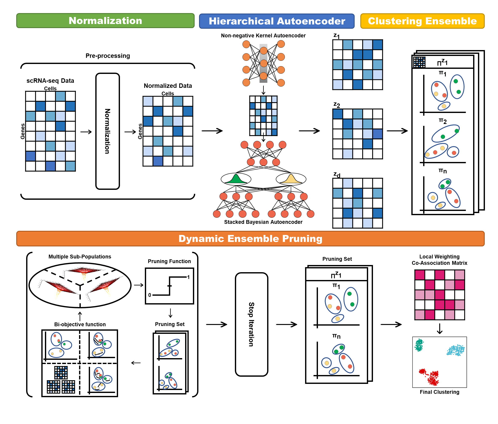
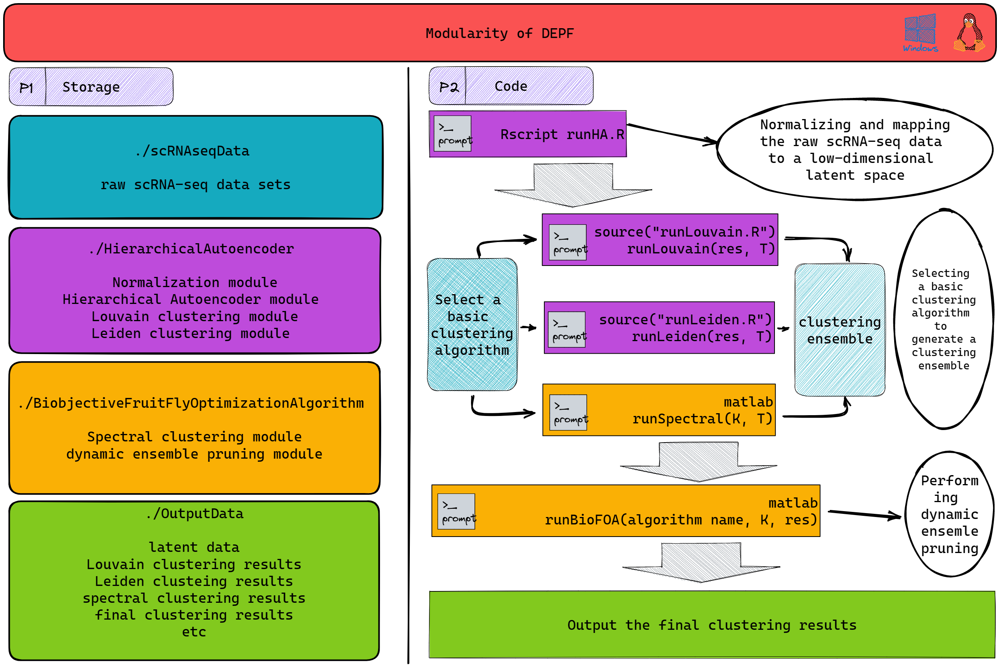

<h2 align="center">
DEPF: Reliable Identification and Interpretation of Single-cell Molecular Heterogeneity and Transcriptional Regulation using Dynamic Ensemble Pruning
</h2>

<p align="center">
  <a href="https://github.com/fanyi21/DEPF">
    
  </a>
  <a href='https://depf.readthedocs.io/en/latest/'>
    
  </a>
  <a href="https://github.com/fanyi21/DEPF/stargazers">
    
  </a>
  <a href="https://github.com/fanyi21/DEPF/network/members">
    
  </a>
  <a href="https://github.com/fanyi21/DEPF/issues">
    
  </a>
  <a href="https://github.com/fanyi21/DEPF/blob/main/LICENSE">
    
  </a>
  <a href="https://github.com/fanyi21/DEPF/graphs/traffic">
    
  </a>
  <!-- ALL-CONTRIBUTORS-BADGE:START - Do not remove or modify this section -->
<a href="https://github.com/fanyi21/DEPF/graphs/contributors"></a>
<!-- ALL-CONTRIBUTORS-BADGE:END -->
</p>


Release: 
  <a href="https://github.com/fanyi21/DEPF/tree/main/DEPF">Source</a>
  
  Links:
  <a href="https://depf.readthedocs.io/en/latest/Description.html">Getting Started</a> |
  <a href="https://depf.readthedocs.io/en/latest/runHA.R.html#">API Reference</a> |
  <a href="https://depf.readthedocs.io/en/latest/Spectral_usage.html">Examples</a>
  


***DEPF:*** A **dynamic ensemble pruning framework (DEPF)** is proposed to identify and interpret single-cell molecular heterogeneity. In particular, a **silhouette coefficient-based indicator** is developed and evaluated to determine the optimization direction of the bi-objective function. In addition, a **hierarchical autoencoder** is employed to project the high-dimensional scRNA-seq data onto multiple low-dimensional latent space sets, and then a **clustering ensemble** is produced in the latent space by the basic clustering algorithm. Following that, a **bi-objective fruit fly optimization algorithm** is designed to prune dynamically the low-quality basic clustering in the ensemble. 



***DEPF*** is constructed based on four modules (***Normalization, Hierarchical Autoencoder, Clustering Ensemble,  Dynamic Ensemble Pruning***) developed by ourselves. It provides five **highlights**:
- &#x1F31E; ***Dynamic ensemble pruning***: many could be better than all.
- &#x1F34E; ***DEPF*** can identify rare cell types and small clusters that would not be picked up by other methods.
- &#x1F31E; ***DEPF*** can identify novel clusters that other traditional methods failed to detect.
- &#x1F34E; ***DEPF*** can provide biological interpretation of scRNA-seq data.
- &#x1F31E; ***DEPF*** can discover transcriptional and post-transcriptional regulators in scRNA-seq data.


## Getting Started


## Table of Contents

- [Installation](#installation)
- [Example](#Example)

### Installation
It is recommended to use **git** for installation.  
```shell
# create a virtual environment named DEPF
$ conda create -n DEPF    
# activate the environment       
$ conda activate DEPF   
# install R enviroment
$ conda install -c conda-forge r-base=4.1.3
$ conda install -c conda-forge r-devtools
$ conda install -c conda-forge r-seurat
$ conda install python=3.9
$ pip install leidenalg
# install MATLAB according to the official website tutorial
# clone DEPF repository                  
$ git clone https://github.com/fanyi21/DEPF.git
# # install the dependencies
$ cd DEPF/DEPF/HierarchicalAutoencoder/
$ Rscript RequirePackage.R
```
### Example
 &#x1F341; ***Step 1***: Normalizing and mapping the raw scRNA-seq data to multiple low-dimensional latent spaces. A ***9_latent_data*** folder is produced and saved in the ***./OutputData***.
```shell
$ cd DEPF/HierarchicalAutoencoder/
$ Rscript runHA.R
```
&#x1F341; ***Step 2***: Selecting a basic clustering algorithm to generate a clustering ensemble. DEPF provides three basic clustering algorithms, including ***Louvain***, ***Leiden***, and ***spectral clustering***.
- &#x1F346; ***Louvain***. The ***Louvain_resolution_1.csv*** is produced and saved in the ***./OutputData***.
```r
$ cd DEPF/HierarchicalAutoencoder/
source("runLouvain.R")
#res: resolution
runLouvain(res=1) 
```
- &#x1F346; ***Leiden***. The ***Leiden_resolution_1.csv*** is produced and saved in the ***./OutputData***.
```r
$ cd DEPF/HierarchicalAutoencoder/
source("runLleiden.R")
#res: resolution
runLeiden(res=1) 
```
- &#x1F346; ***spectral clustering***. The ***spectral_cluster_K_10.csv*** is produced and saved in the ***./OutputData***.
```matlab
$ cd DEPF/BiobjectiveFruitFlyOptimizationAlgorithm/
% K: cluster number; T: ensemble size
runSpectral(K=10, T=10) 
```
&#x1F341; ***Step 3***: Performing dynamic ensemble pruning. The ***final_clustering.csv*** is produced and saved in the ***./OutputData***.
```matlab
$ cd DEPF/BiobjectiveFruitFlyOptimizationAlgorithm/
runBioFOA("spectral", 10, 1)
% output
NMI: 0.8900
ARI: 0.9100
```
> **Note: `DEPF` is still under development, please see [API reference](https://depf.readthedocs.io/en/latest/) for the latest list.**

## Contact:
Thank you for using DEPF! Any questions, suggestions or advices are welcome.

email address:[lixt314@jlu.edu.cn](lixt314@jlu.edu.cn), [fanyi21@mails.jlu.edu.cn](fanyi21@mails.jlu.edu.cn)

